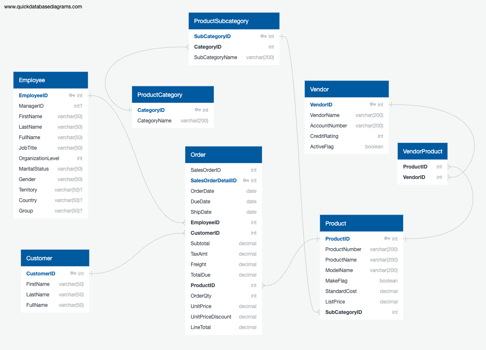
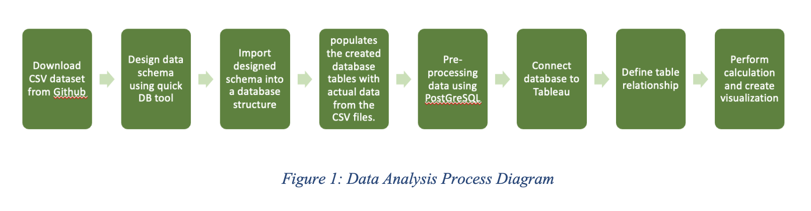
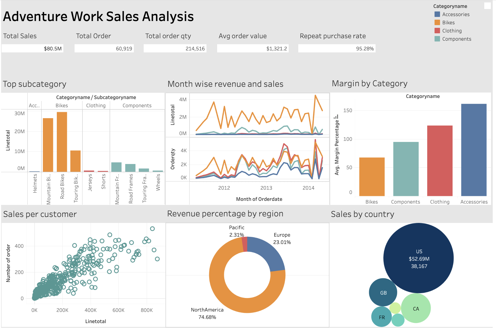

# Adventure-Work-Sales-Analysis
This report delves into the dynamic landscape of retail sales, focusing on the analysis of product category performance over time. This report uses a sample dataset of Adventure Work which was inspired by the original dataset of "AdventureWorks sample databases" from Microsoft’s database sample. For the purpose of demonstrating Data Storage techniques to store data in the relational database, I use the csv dataset from Github. The dataset consists of 8 CSV files, each representing a core aspect of the business.

## Data pre-processing:
- Tool: Quick DBD, PostgreSQL, Tableau
- Technique: data filtering, exclusion, transformation, partitioning, merging and data visualization
- The data schema was initially designed using the Quick DBD tool, from which an SQL script was generated and subsequently imported into PostgreSQL for table creation.

### Data processing using PostGreSQL
- Data Deletion: In the VendorProduct table, several ProductIDs did not correspond to any entries in the Product table, thus breaching the foreign key constraint. To resolve this, ProductIDs not found in the Product table were removed from the VendorProduct table, after which the foreign key constraints for VendorID and ProductID were reinstated.
- Data Updating: Some employees, specifically managers, lacked a corresponding group_name in the database, resulting in null entries. An update operation was utilized to rectify this: for instance, employees with the title 'NorthAmericanSalesManager' were assigned 'NorthAmerica' as their group_name.
- Custom Query for Repeat Purchase Rate in PostgreSQL: The repeat purchase rate was calculated by dividing the quantity of repeat customers by the total customer count and multiplying the result by 100, revealing an approximate repeat purchase rate of 95%.
### Data processing using Tableau
- Margin Column Addition: A margin calculation was performed directly within Tableau, defined as the difference between ListPrice and StandardCost. The average margin was then computed with the formula: Margin Percentage = (ListPrice - StandardCost) / StandardCost * 100
- Data Type Modification: The 'Territory', 'Country', and 'Group_name' columns were converted from VARCHAR to geographical data types within Tableau. This allows geographic mapping in subsequent analyses.
## Data analysis and findings
- Revenue by Subcategory: Bikes, especially Road and Mountain types, are top revenue contributors. Accessories have lower revenues, suggesting less demand or lower prices.
- Monthly Trends: Seasonal patterns in sales are evident, peaking during outdoor activity seasons and dipping in February, pointing to potential customer behavior or inventory issues.
- Profit Margins: Accessories offer higher margins despite lower revenues, indicating a high-profit pricing strategy. Balancing margin and volume is key for profit.
- Customer Purchase Patterns: More frequent orders correlate with higher sales revenue, yet many customers make infrequent purchases.
- Regional Revenue: North America leads in sales, with Europe following. The Pacific is the smallest market, influencing marketing and growth strategies.
- Country Sales: The US significantly outperforms GB, FR, and CA in sales, showing strong market presence.
You can view the dashboard here:
https://public.tableau.com/app/profile/linh.phuong.khanh.vo/viz/AdventureWorkSalesAnalysis_17028178213730/Dashboard1

